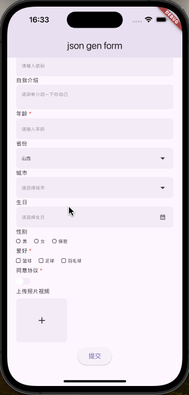

<div align="center">
<h1>JSON_GEN_FORM</h1>

<p>Generate Flutter forms using JSON, featuring a variety of built-in form controls,<br/> support for validation, custom layouts, custom styles, and unlimited nested form grouping.</p>

English · [中文](./README-zh.md)



</div>

## Features

- Render form using JSON
- Form validation
- Custom form styles
- Custom layouts (row, col)
- Infinite form grouping and nesting (group)
- Modify entire form values or individual form control values through methods
- Form controls:
  - Text box
  - Password box
  - Textarea
  - Number
  - Radio button
  - Checkbox
  - Dropdown
  - Switch
  - Multimedia upload
  - Date picker
  - Time picker
  - DateTime picker

## Usage

```dart
import 'package:flutter/material.dart';
import 'package:json_gen_form/json_gen_form.dart';

void main() {
  runApp(const MainApp());
}

class MainApp extends StatefulWidget {
  const MainApp({super.key});

  @override
  State<MainApp> createState() => _MainAppState();
}

class _MainAppState extends State<MainApp> {
  final GlobalKey _key = GlobalKey<JsonGenFormState>();
  final List<dynamic> _data = [
    {
      "type": "text",
      "field": "name",
      "label": "姓名",
      "value": "隔壁老王",
      "placeholder": "请输入姓名",
      "rules": [
        {"required": true, "message": "请输入姓名"}
      ]
    },
    {
      "type": "textarea",
      "field": "remark",
      "label": "自我介绍",
      "value": null,
      "placeholder": "请简单介绍一下你自己",
      "rules": []
    },
    {
      "type": "number",
      "field": "age",
      "label": "年龄",
      "value": null,
      "placeholder": "请输入年龄",
      "rules": [
        {"required": true, "message": "请输入年龄"},
        {"min": 18, "message": "年龄必须大于18岁"}
      ]
    }
  ];

  @override
  Widget build(BuildContext context) {
    return MaterialApp(
      theme: ThemeData(
        brightness: Brightness.light,
        useMaterial3: true,
      ),
      home: Scaffold(
        appBar: AppBar(
          title: const Text('json gen form'),
        ),
        body: SafeArea(
          child: SingleChildScrollView(
            physics: const BouncingScrollPhysics(),
            padding: const EdgeInsets.symmetric(
              horizontal: 20.0,
              vertical: 20.0,
            ),
            child: Column(
              children: [
                JsonGenForm(
                  key: _key,
                  config: _data,
                  decoration: JsonGenFormDecoration(
                    // groupLabelWrap: (Widget child, dynamic data) {
                    //   return Container(
                    //     margin: const EdgeInsets.only(bottom: 5),
                    //     child: child,
                    //   );
                    // },
                    controlLabelWrap: (Widget child, dynamic data) {
                      return Container(
                        margin: const EdgeInsets.only(bottom: 5),
                        child: child,
                      );
                    },
                    controlWrap: (Widget child, dynamic data) {
                      return Container(
                        margin: const EdgeInsets.only(bottom: 10),
                        child: child,
                      );
                    },
                  ),
                ),
                ElevatedButton(
                  onPressed: () async {
                    final formState = _key.currentState as JsonGenFormState;
                    try {
                      final data = await formState.validate();
                      debugPrint('Validation success $data');
                    } catch (e) {
                      debugPrint('Validation error: $e');
                    }
                  },
                  child: const Text('Submit'),
                ),
              ],
            ),
          ),
        ),
      ),
    );
  }
}
```

## General Parameters

Except for `group`, `row`, and `col`, all types have the following general parameters. All types have `extra`.

| Field       | Description      | Type    | Default Value | Required |
| ----------- | ---------------- | ------- | ------------- | -------- |
| type        | Type             | String  | ''            | true     |
| field       | Field Name       | String  | ''            | true     |
| label       | Label            | String  | -             | -        |
| hiddenLabel | Hidden Label     | bool    | false         | -        |
| value       | Default Value    | dynamic | -             | -        |
| disabled    | Disabled         | bool    | false         | -        |
| readonly    | Read-Only        | bool    | false         | -        |
| rules       | Validation Rules | List    | []            | -        |
| extra       | Extra Params     | dynamic |               | -        |

## Form Types

### group

| Field       | Description  | Type      | Default Value | Required |
| ----------- | ------------ | --------- | ------------- | -------- |
| type        | Type         | String    | 'group'       | true     |
| field       | Field Name   | String    | ''            | -        |
| label       | Label        | String    | ''            | -        |
| hiddenLabel | Hidden Label | bool      | ''            | -        |
| children    | Sub-Forms    | List<Map> | []            | -        |

### text

| Field          | Description | Type   | Default Value | Required |
| -------------- | ----------- | ------ | ------------- | -------- |
| type           | Type        | String | 'text'        | true     |
| placeholder    | Placeholder | String | -             | -        |
| General Params | -           | -      | -             | -        |

### password

| Field          | Description | Type   | Default Value | Required |
| -------------- | ----------- | ------ | ------------- | -------- |
| type           | Type        | String | 'password'    | true     |
| placeholder    | Placeholder | String | -             | -        |
| General Params | -           | -      | -             | -        |

### textarea

| Field          | Description | Type   | Default Value | Required |
| -------------- | ----------- | ------ | ------------- | -------- |
| type           | Type        | String | 'textarea'    | true     |
| placeholder    | Placeholder | String | -             | -        |
| General Params | -           | -      | -             | -        |

### number

| Field          | Description | Type   | Default Value | Required |
| -------------- | ----------- | ------ | ------------- | -------- |
| type           | Type        | String | 'number'      | true     |
| placeholder    | Placeholder | String | -             | -        |
| General Params | -           | -      | -             | -        |

### radio

| Field               | Description           | Type      | Default Value | Required |
| ------------------- | --------------------- | --------- | ------------- | -------- |
| type                | Type                  | String    | 'radio'       | true     |
| options             | Options               | List<Map> | []            | -        |
| direction           | Options Direction     | String    | 'horizontal'  | -        |
| itemHorizontalSpace | Item Horizontal Space | double    | 16            | -        |
| itemVerticalSpace   | Item Vertical Space   | double    | 8             | -        |
| General Params      | -                     | -         | -             | -        |

### checkbox

| Field               | Description           | Type      | Default Value | Required |
| ------------------- | --------------------- | --------- | ------------- | -------- |
| type                | Type                  | String    | 'checkbox'    | true     |
| options             | Options               | List<Map> | []            | -        |
| direction           | Options Direction     | String    | 'horizontal'  | -        |
| itemHorizontalSpace | Item Horizontal Space | double    | 16            | -        |
| itemVerticalSpace   | Item Vertical Space   | double    | 8             | -        |
| General Params      | -                     | -         | -             | -        |

### select

| Field          | Description     | Type      | Default Value | Required |
| -------------- | --------------- | --------- | ------------- | -------- |
| type           | Type            | String    | 'select'      | true     |
| options        | Options         | List<Map> | []            | -        |
| multiple       | Multiple Select | bool      | false         | -        |
| General Params | -               | -         | -             | -        |

### switch

| Field          | Description | Type   | Default Value | Required |
| -------------- | ----------- | ------ | ------------- | -------- |
| type           | Type        | String | 'switch'      | true     |
| General Params | -           | -      | -             | -        |

### media

| Field          | Description                      | Type   | Default Value | Required |
| -------------- | -------------------------------- | ------ | ------------- | -------- |
| type           | Type                             | String | 'media'       | true     |
| mediaType      | Media Type (media, image, video) | String | 'media'       | -        |
| multiple       | Multiple Uploads                 | bool   | false         | -        |
| General Params | -                                | -      | -             | -        |

#### ios Configuration info.plist

```
<key>NSCameraUsageDescription</key>
<string>Need camera for taking photos or scanning codes</string>
<key>NSPhotoLibraryUsageDescription</key>
<string>Need access to photo library for selecting photos or videos</string>
<key>NSMicrophoneUsageDescription</key>
<string>Need microphone access for recording videos</string>
```

#### android Configuration AndroidManifest.xml

```
<uses-permission android:name="android.permission.CAMERA" />
```

### date

| Field | Description | Type   | Default Value | Required |
| ----- | ----------- | ------ | ------------- | -------- |
| type  | Type        | String | 'date'        | true     |

### time

| Field | Description | Type   | Default Value | Required |
| ----- | ----------- | ------ | ------------- | -------- |
| type  | Type        | String | 'time'        | true     |

### datetime

| Field | Description | Type   | Default Value | Required |
| ----- | ----------- | ------ | ------------- | -------- |
| type  | Type        | String | 'datetime'    | true     |

## Layout Types

### row

`row`'s `children` must have `type` as `col`.

| Field    | Description | Type   | Default Value | Required |
| -------- | ----------- | ------ | ------------- | -------- |
| type     | Type        | String | 'row'         | true     |
| gutter   | Spacing     | double | 0             | -        |
| children | Children    | List   | []            | -        |

### col

`col`'s parent must be `row`.

| Field | Description  | Type   | Default Value | Required |
| ----- | ------------ | ------ | ------------- | -------- |
| type  | Type         | String | 'col'         | true     |
| flex  | Flex         | int    | 1             | -        |
| child | Child Config | Map    |               |          |

### group

| Field | Description | Type   | Default Value | Required |
| ----- | ----------- | ------ | ------------- | -------- |
| type  | Type        | String | 'group'       | true     |
| field | Field Name  | String | null          | -        |

## Validation Rules

- required
- type: Shortcut validation type, only supported for text input
  - email
  - url
- min: For string type, it's string length; for number type, it's a specific number; for array type, it's array length
- max: For string type, it's string length; for number type, it's a specific number; for array type, it's array length
- len: For string type, it's string length; for number type, it's a specific number; for array type, it's array length
- pattern: Regex validation
- message: Error message
